# CESFAM San Juan — Módulo de Urgencia (línea V4)

Sistema de gestión de **pacientes de urgencia para el CESFAM San Juan**, construido sobre
**Google Apps Script** con Google Sheets como capa de datos. Esta rama del proyecto corresponde
a la línea **V4**: fichas PADI, agenda médica, alertas y módulo de recepción.

> 📌 Este repositorio es la **versión activa** del sistema.
> Las versiones anteriores (v0, v1, v3 pre-V4) se conservan en [`versiones-anteriores/`](versiones-anteriores/).

## Funcionalidades

- 🧑‍⚕️ **Fichas de pacientes** (formato PADI) con historial por paciente
- 📅 **Agenda** de atenciones
- 🔔 **Alertas** clínicas y administrativas
- 🚪 **Recepción**: ingreso y triaje de pacientes
- 💾 **Backup** integrado de datos
- 🎨 Sistema de diseño unificado (`02_DesignSystem.js`)

## Capturas

> Datos ficticios · capturas: agosto 2026 · línea V4

### Dashboard

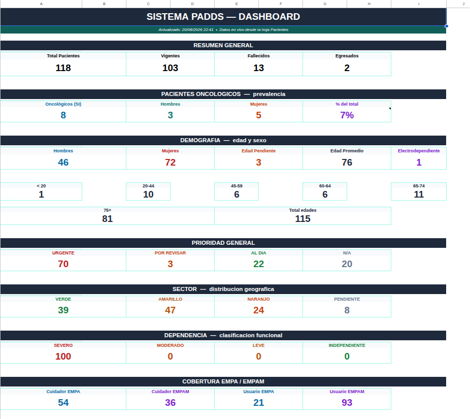
*Dashboard principal · ago 2026 · v4*

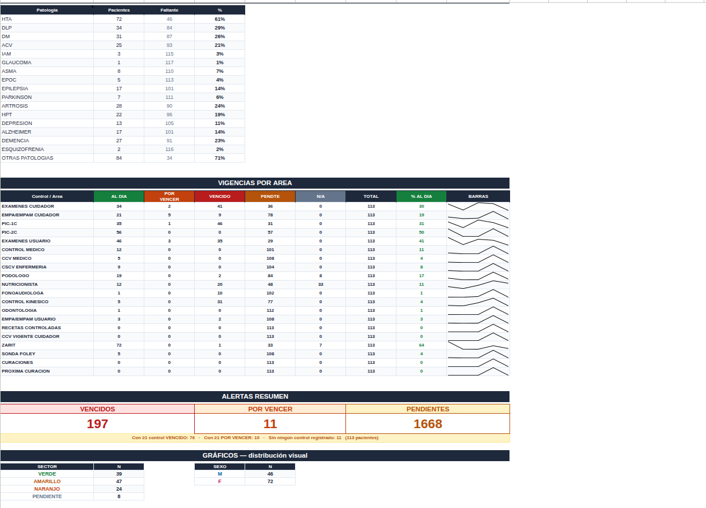
*Vista alternativa del dashboard · ago 2026 · v4*

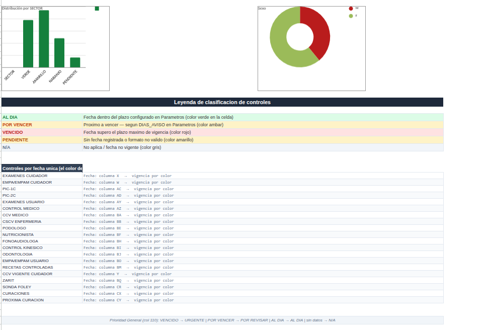
*Tercera vista del dashboard · ago 2026 · v4*

### Pacientes

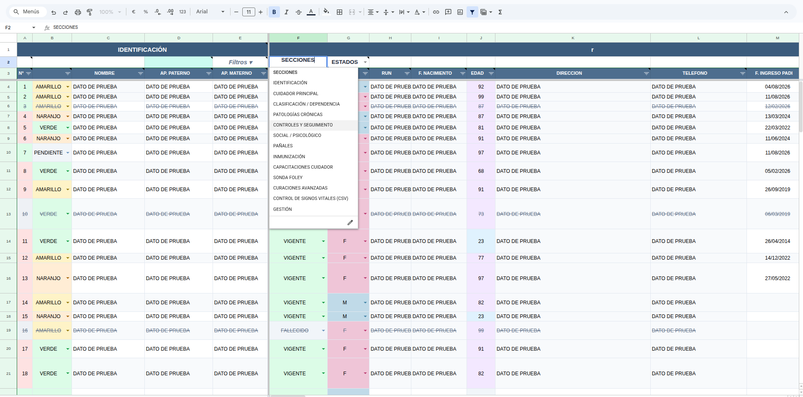
*Hoja de pacientes · ago 2026 · v4*

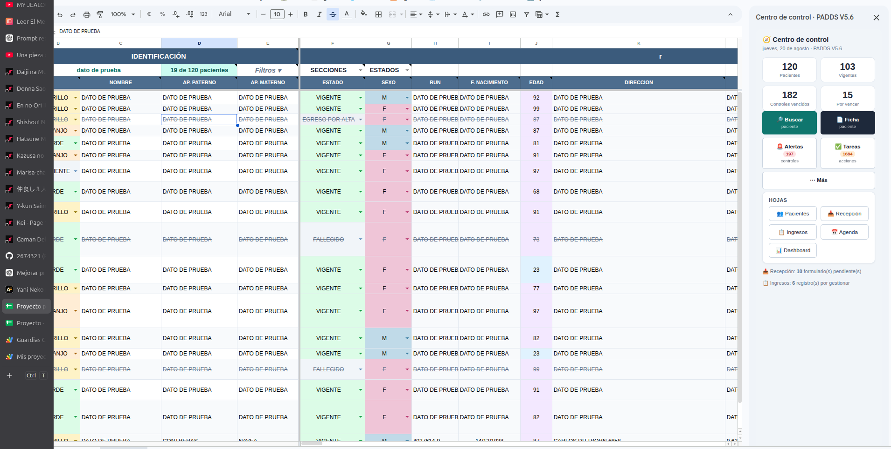
*Hoja de pacientes y centro de control · ago 2026 · v4*

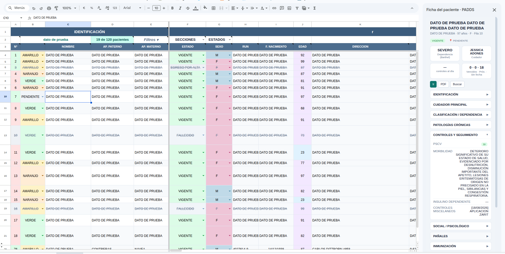
*Ficha de usuario · ago 2026 · v4*

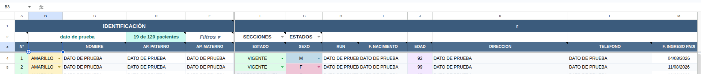
*Buscador en hoja de pacientes · ago 2026 · v4*

### Módulos

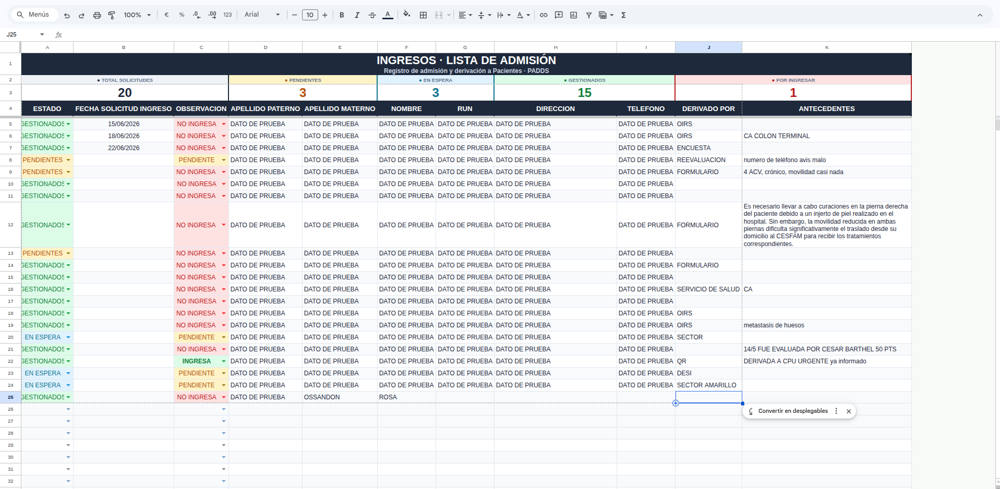
*Ingresos de usuarios PADI · ago 2026 · v4*

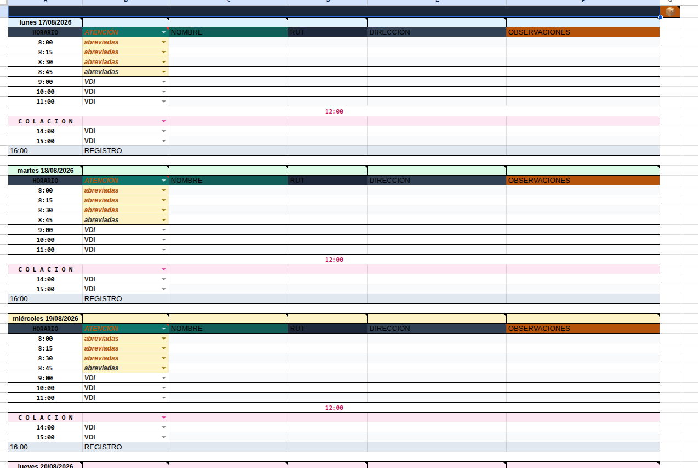
*Formato de agenda · ago 2026 · v4*

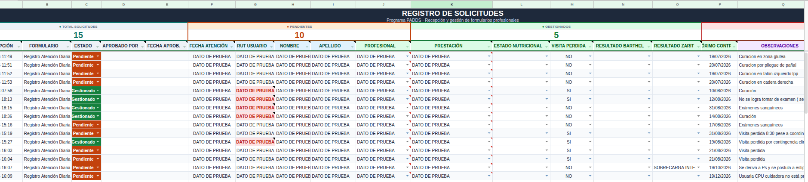
*Recepción de formularios de solicitudes/atenciones · ago 2026 · v4*

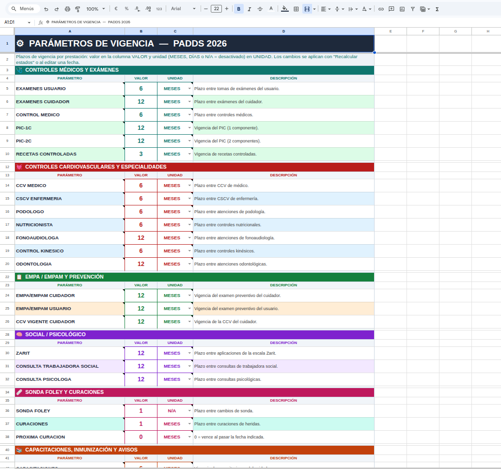
*Hoja de parámetros · ago 2026 · v4*
## Estructura

| Archivo | Módulo |
|---------|--------|
| `00_Constantes.js` | Constantes globales |
| `01_Utilidades.js` | Utilidades compartidas |
| `02_DesignSystem.js` | Sistema de diseño (UI) |
| `03_Pacientes.js` | Fichas PADI de pacientes |
| `04_Eventos.js` | Eventos / atenciones |
| `05_Alertas.js` | Alertas |
| `06_Formato.js` | Formato de planillas |
| `07_Agenda.js` | Agenda médica |
| `08_Recepcion.js` | Recepción e ingresos |
| `09_Config.js` | Configuración |
| `10_Pruebas.js` | Pruebas |
| `11_Ingresos.js` | Ingresos |
| `12_Backup.js` | Respaldo de datos |
| `13_V4.js` | Núcleo de la línea V4 |

## Desarrollo

El proyecto se sincroniza con Apps Script mediante [clasp](https://github.com/google/clasp):

```bash
clasp login          # primera vez
clasp push           # subir cambios locales → Apps Script
clasp pull           # bajar cambios desde Apps Script
```

## Estado

- ✅ En producción — versión activa (línea V4)
- Etiqueta actual: `v4.0`

---

Desarrollado por [@2674321](https://github.com/2674321) · Coquimbo, Chile


## Versiones

- **Actual (V4):** módulos numerados en la raíz.
- **v3 (pre-V4):** `versiones-anteriores/v3-prev4/` — última versión antes del rediseño V4.
- **v1 (deprecated):** `versiones-anteriores/v1-deprecated/` — primera versión Apps Script.
- **v0 (tambeni):** `versiones-anteriores/v0-tambeni/` — variante previa más antigua.

> La planilla Excel original del servicio **no se publica** por contener datos
> clínicos personales de pacientes; se conserva solo de forma local y privada.
